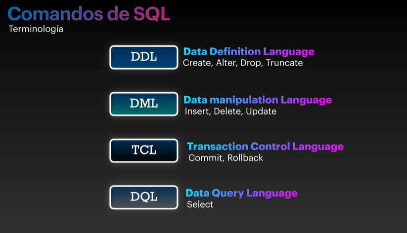

# Comando SQL: DDL, DML, TCL & DQL

## DDL: Data Definition Language
Create, Alter, Drop y Truncate

## DML: Data Manipulation Language
Insert Delete y Update

## TCL: Transaction Control Language
Commit, Rolback

## DQL Data Query Language
Select 

